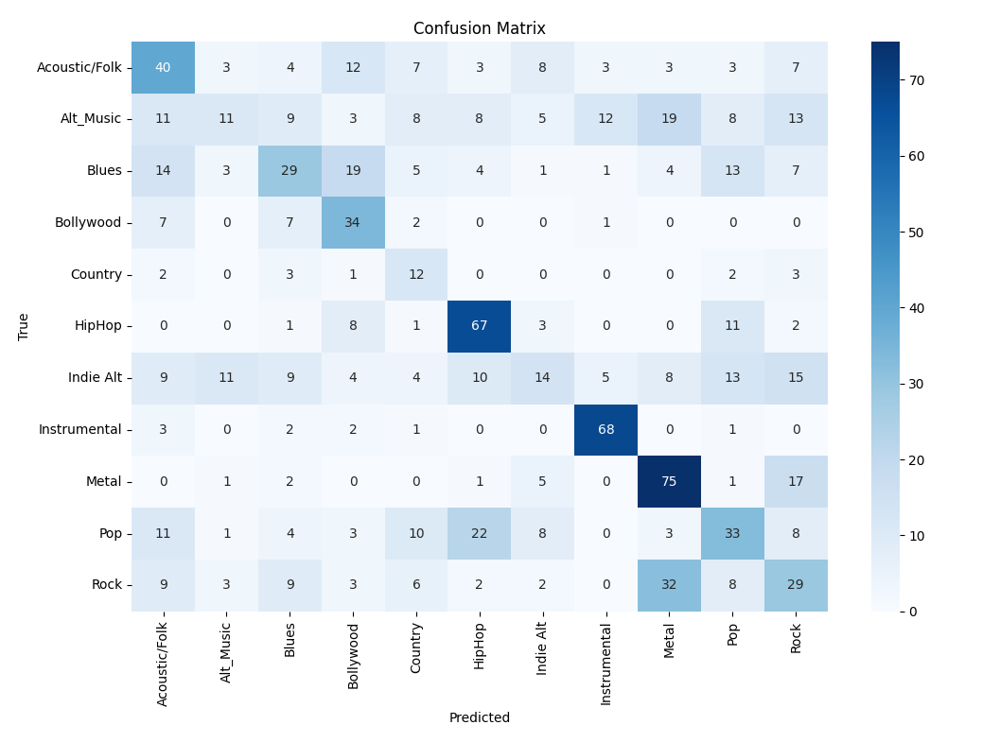
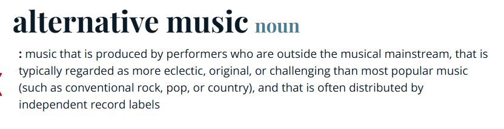

---

# Podstawy Sztucznej Inteligencji

## Raport z projektu

<p align="right">Korzeniak Jakub, Graboś Mateusz</p>


# 1. Określenie tematu i celu projektu, analiza wymagań

Tematem naszego projektu jest zbadanie sposobów w jaki sztuczna inteligencja może "słyszeć" muzykę, oraz ją interpretować.
 Celem naszego projektu jest klasyfikacja utworów muzycznych używając algorytmów sztucznej inteligencji, oraz danych zawierających wiele różnych parametrów tych utworów.

# 2. Zbiór Danych i ich przygotowanie

  

## Zbiór Danych

  

Użyliśmy  następującego  zbioru  danych:  https://www.kaggle.com/datasets/purumalgi/music-genre-classification

Zbiór zawiera zarówno dane uczące jak i dane testowe, jest ich wystarczająco dużo aby przeprowadzić na nich uczenie maszynowe.
  

## Czyszczenie danych: `cleandata.py`

### 🔍 Opis

Skrypt  `cleandata.py`  służy  do  czyszczenia  oraz  wstępnego  przetwarzania  danych  z  plików  test.csv  i  train.csv:

-  Usuwa  utwory  z  brakującymi  wyrazami  w  jakiejkolwiek  kolumnie

-  Usuwa  utwory  ze  tylułami  lub  autorami  ze  znakami  spoza  ASCII

  

Następnie  zapisuje  zmienione  pliki  pod  nazwami  clean_test.csv  oraz  clean_train.csv.

  

### 💻 Kod

#### Ważniejsze fragmenty kodu:

Wczytanie  danych  i  usuwanie  niepkompletnych  utworów

```python

test_df  =  pd.read_csv(data_path_test)

test_df.dropna(inplace=True)

```

Znalezienie  i  usunięcie  utworów  z  tylułami  lub  autorami  ze  znakami  spoza  ASCII

```python

def  is_ascii(s):

return  bool(re.match(r'^[\x00-\x7F]+$',  str(s)))

clean_test_df  =  test_df[test_df["Artist  Name"].apply(is_ascii)  &  test_df["Track  Name"].apply(is_ascii)]

```

Te  same  działania  następnie  czyszczą  plik  train.csv.

W obydwu oczyszczonych plikach, pozostawiono nazwy wykonawców oraz tytuły piosenek w celu lepszej czytelności. Kolumny te nie będą interpretowane przez model AI.

# 3. Wybór i implementacja modelu AI

### 📖 Opis

W celu stworzenia modelu wybrano odpowiednie kolumny z danymi z pliku clean_train.csv stworzonego w poprzednim kamieniu milowym.
Odrzucono takie kolumny jak: "Artist name", "Track name", "Popularity".
Następnie przeskalowano dane wejściowe tak aby miały odchylenie standardowe równe jeden, a średnią równą zero, co ma zapewnić równy wkład każdego parametru do modelu.

W kolejnym kroku wydzielono dane wyjściowe, czyli kolumnę "Class" w której przechowywany jest numer oznaczający gatunek muzyczny, są to odpowiednio:

Acoustic/Folk - 0, Alt_Music - 1, Blues - 2, Bollywood - 3, Country - 4, HipHop - 5,Indie Alt - 6, Instrumental - 7,Metal - 8, Pop - 9, Rock - 10

Następnie zbudowano prosty model z trzech warstw sieci neuronowych, przesłano do niego wydzielone wcześniej dane i rozpoczęto jego trening.

### 🔣 Kod

Budowa modelu przebiega następująco

```python

model = Sequential([
    Dense(64, activation='relu',),
    Dense(64, activation='relu'),
    Dense(11, activation='softmax')  
])

```

Trenowanie modelu wygląda następująco

```python

model.fit(X_train, y_train, epochs=50,
          validation_data=(X_test, y_test),
          class_weight=class_weight_dict,
          callbacks=[early_stop]
          )

```

# 4. Ocena wyników modelu i optymalizacja

Poniższy screen przedstawia rozkład predykcji dokonanych przez wytrenowany model.

  

Uwagę przykuwają predykcję dwóch gatunków muzyki: Alt_Music oraz Indie_Alt, otóż model wydaje się w przypadku tych dwóch gatunków zgadywać, nie mogąc się zdecydować który gatunek wybrać, bierze je za każdy inny gatunek po równo.
Aby zrozumieć skąd takie zachowanie modelu wystarczy spojrzeć na definicję gatunku Alt_Music (dotyczy to także gatunku Indie_Alt):

  

Otóż definicja w słowniku merriam-webster głosi że muzyka alternatywna to taka która jest stworzona przez producenta który jest spoza mainstreamu.
Oznacza to że muzyka alternatywna może zostać uznana za inny gatunek ponieważ model nie wie co jest w mainstreamie a co nie, wobec czego model nie jest w stanie jednoznacznie rozpoznać na podstawie podanych parametrów, tych dwóch gatunków muzyki ( lub potrzebuje do tego znacznie więcej próbek ).

Istnieją też pary gatunków muzyki które są mylone przez model: Pop -> HipHop, Rock -> Metal.

Ogólnie Model wykazuje dokładność około 40% na danych testowych, jednak odrzucając powyższe przypadki, model radzi sobie całkiem dobrze.
Należy także wziąźć pod uwagę że nawet ludzie w niektórych przypadkach mają problem określić gatunek muzyczny.

W celu poprawy oceny modelu zwiększano ilość warstw sieci, ilość neuronów w warstwach, ilość epoch, zmniejszano learning rate, oraz dostosowywano batch size, wszystko bezskutecznie, co potwierdza że to dane sprawiają problemy.

# 5. Wdrożenie modelu i monitororwanie

Napisano prosty skrypt konwertujący napisany model do formatu onnx:

```python

import tf2onnx
import tensorflow as tf

print("Podaj sciezke do modelu AI: ", end="")
fileName = input()

kerasModel = tf.keras.models.load_model(fileName)
kerasModel.output_names = ['outputLayer']

spec = (tf.TensorSpec(kerasModel.inputs[0].shape, tf.float32, name="input"),)

onnxModel = tf2onnx.convert.from_keras(kerasModel, output_path="model.onnx", input_signature=spec)

```

Jest to open-sourcowy format który został stworzony z myślą o przenoszeniu modeli AI między różnymi językami programowania i narzędziami.

Następnie zaimportowano ten model do programu w Javie który umożliwia korzystanie z niego użytkownikom.